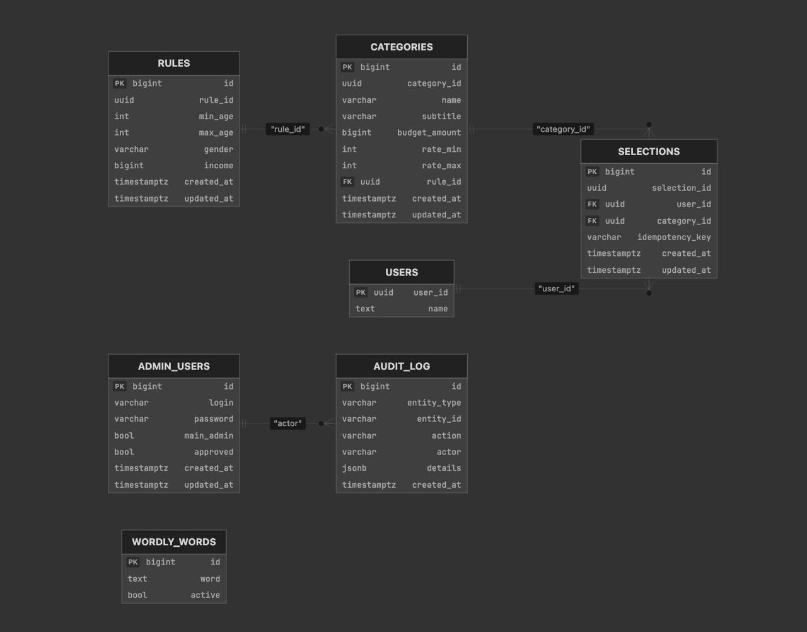

# Backend сервиса T-Cash

**О проекте.** Backend решает задачу управляемого кэшбэка: админка настраивает категории, правила отбора и бюджеты; клиент получает персональный список категорий (`offers/run`), выбирает их и подтверждает выбор; сервер гарантирует лимиты, идемпотентность и проверку бюджетов на своей стороне.

**Документация API:** после запуска сервера доступны [Swagger UI](http://localhost:8080/docs) и [OpenAPI (JSON)](http://localhost:8080/docs/swagger.json).

---

## Содержание

- [Какую задачу решает backend](#какую-задачу-решает-backend)
- [Архитектура системы](#архитектура-системы)
- [Модель данных](#модель-данных)
- [Переходы состояний](#переходы-состояний)
- [Документация API (Swagger / OpenAPI)](#документация-api-swagger--openapi)
- [Основной сценарий работы](#основной-сценарий-работы)
- [Тестирование](#тестирование)
- [RUNBOOK: запуск локально](#runbook-запуск-локально)
- [Авторизация, тестовые данные, интеграции и ограничения](#авторизация-тестовые-данные-интеграции-и-ограничения)
- [Наблюдаемость и эксплуатация](#наблюдаемость-и-эксплуатация)
- [Границы MVP и развитие](#границы-mvp-и-развитие)

---

## Какую задачу решает backend

Кэшбэк увеличивает оборот и вовлечение, но легко выходит из-под контроля по стоимости. Backend обеспечивает продукт, в котором клиенту интересно, а экономика управляема.

**Основные возможности:**

- управление категориями кэшбэка через админку (создание, правки, бюджеты, диапазоны ставок, правила отбора по возрасту/полу/доходу);
- персональный расчёт предложений для клиента (`POST /api/v1/offers/run`) с учётом правил и при необходимости внешнего ML-сервиса;
- подтверждение выбора категорий с идемпотентностью (`Idempotency-Key`), прогресс клиента, аудит изменений.

**Гарантии:** проверка диапазонов ставок и бюджетов на сервере; защита от повторных действий по ключу идемпотентности; все бюджетные инварианты проверяются в бекенде, а не только в интерфейсе.

---

## Архитектура системы

Сервис построен по слоёной архитектуре: зависимости направлены внутрь (HTTP → бизнес-логика → данные), что упрощает изменения и расширения.

**Взаимодействие компонентов:**

- **Клиент / Админка** → HTTP-запросы к **aiohttp-приложению** (`server.py`, маршруты в `api/`).
- **Обработчики API** (`api/*.py`) валидируют вход, вызывают **функции бизнес-логики** (`functions/`) и формируют ответ.
- **Бизнес-логика** (категории, правила, выбор, расчёт офферов) обращается к **слою данных** (`database/`) и при расчёте офферов — к **внешнему ML-сервису** (переменная `ML_SERVICE_URL`, по умолчанию `http://127.0.0.1:8008`).
- **Слой данных** (`database/database.py`, `database/functions.py`) выполняет запросы к **PostgreSQL**; миграции схемы — **Alembic** (`alembic/`).

**Основные компоненты:**

| Слой | Назначение | Компоненты |
|------|------------|------------|
| **HTTP/API** | Приём запросов, валидация, ответы, контракты | `server.py`, `api/*.py`, `docs/schemas.py` |
| **Бизнес-логика** | Правила домена, расчёт офферов, бюджеты, идемпотентность | `functions/categories.py`, `functions/selection.py`, `functions/calculate.py` и др. |
| **Данные** | Подключение к БД, транзакции, миграции, загрузка CSV | `database/database.py`, `database/functions.py`, `alembic/` |

**Стек:** Python 3.12, aiohttp, asyncpg (PostgreSQL), marshmallow + aiohttp-apispec (Swagger), Alembic, Docker/docker compose.

**Структура проекта:**

```text
backend/
├── api/                    # HTTP-обработчики
│   ├── categories.py       # CRUD категорий, правило, run/pause/archive, аудит
│   ├── calculate.py       # POST /offers/run
│   ├── selection.py       # подтверждение выбора (Idempotency-Key)
│   ├── audit.py           # журнал аудита
│   ├── users.py           # выдача JWT клиенту
│   ├── wordly.py          # игра T-Word
│   └── validate.py        # валидация и формат ошибок
├── functions/              # бизнес-логика
│   ├── categories.py
│   ├── selection.py
│   ├── calculate.py       # расчёт офферов, вызов ML-сервиса
│   └── ...
├── database/
│   ├── database.py        # обёртка asyncpg, транзакции
│   └── functions.py       # инициализация БД, загрузка CSV
├── docs/schemas.py        # marshmallow-схемы для Swagger
├── alembic/versions/      # миграции схемы БД
├── data/                  # CSV для загрузки (categories, users)
├── server.py              # точка входа aiohttp
├── config.py
├── docker-compose.yml
├── Dockerfile
└── requirements.txt
```

---

## Модель данных

**Ключевые сущности:**

- **rules** — правила отбора (min_age, max_age, gender, income). Связь: категория ссылается на правило через `rule_id`.
- **categories** — категории кэшбэка: name, subtitle, icon_url, budget_amount, rate_min, rate_max, status, rule_id. Одна категория — одно правило.
- **selections** — выбор пользователя: user_id, category_id, selection_id, idempotency_key. Один пользователь может выбрать несколько категорий (уникальность по паре user_id + category_id).
- **audit_log** — журнал событий по сущностям (entity_type, entity_id, action, actor, details).
- **users** — клиенты (для offers/run и client/selection); **admin_users** — администраторы; **wordly_words** — слова игры T-Word.

**Схема БД:** сущностно-реляционная диаграмма — [ER.png](ER.png) в корне репозитория. Таблицы и связи описаны в миграциях Alembic (`alembic/versions/`).



**Колонки основных таблиц (кратко):**

| Таблица | Ключевые колонки |
|---------|-------------------|
| **rules** | rule_id (UUID), min_age, max_age, gender, income, created_at, updated_at |
| **categories** | category_id (UUID), name, subtitle, icon_url, budget_amount, rate_min, rate_max, status, rule_id → rules |
| **selections** | selection_id (UUID), user_id, category_id → categories, idempotency_key, created_at, updated_at |
| **audit_log** | entity_type, entity_id, action, actor, details, created_at |

---

## Переходы состояний

**Категория (status):**

- **running** — участвует в расчёте и выдаётся клиенту. Переход: `POST .../categories/{id}/run`.
- **paused** — временно исключена из расчёта. Переход: `POST .../categories/{id}/pause`.
- **archived** — мягкое удаление, в расчётах не участвует. Переход: `DELETE .../categories/{id}/archive`.

Переходы между running ↔ paused, а также в archived заданы эндпоинтами и логикой в `api/categories.py` и `functions/categories.py`.

**Выбор клиента (selections):**

- Создание записи при подтверждении выбора (`POST /api/v1/client/selection` с `Idempotency-Key`). Повторный запрос с тем же ключом и тем же телом возвращает сохранённый результат (идемпотентность); при том же ключе и другом теле — 409.

Жизненный цикл выбора и сценарии отмены/изменения заданы в `api/selection.py` и `functions/selection.py`.

---

## Документация API (Swagger / OpenAPI)

После запуска приложения:

- **Swagger UI:** [http://localhost:8080/docs](http://localhost:8080/docs) — интерактивная документация и возможность вызывать эндпоинты.
- **OpenAPI (JSON):** [http://localhost:8080/docs/swagger.json](http://localhost:8080/docs/swagger.json) — машиночитаемая спецификация.

Схемы запросов и ответов определены в `docs/schemas.py` и подхватываются aiohttp-apispec.

**Обзор эндпоинтов:**

- **Админка:** `GET/POST /api/v1/admin/categories`, `GET/PATCH /api/v1/admin/categories/{id}`, `POST/PATCH .../categories/{id}/rule`, `POST .../run`, `POST .../pause`, `DELETE .../archive`, `GET .../audit`, `GET/POST .../categories/settings`; авторизация админа — `/api/v1/admin/auth/register`, `/api/v1/admin/auth/login`.
- **Клиент:** `GET /api/v1/users/{user_id}/auth` (выдача JWT), `POST /api/v1/offers/run`, `POST /api/v1/client/selection` (обязателен `Idempotency-Key`), `GET /api/v1/client/progress`.
- **Аудит:** `GET /api/v1/admin/categories/{id}/audit`.

---

## Основной сценарий работы

Сценарий, по которому проверяется работоспособность системы:

1. **Настройка** — в админке создаются/редактируются категории, правила отбора и бюджеты (эндпоинты `admin/categories`, `.../rule`, run/pause/archive).
2. **Персональный расчёт** — клиент с JWT вызывает `POST /api/v1/offers/run` и получает список категорий для выбора.
3. **Выбор** — клиент выбирает категории в интерфейсе и отправляет подтверждение: `POST /api/v1/client/selection` с заголовком `Idempotency-Key`.
4. **Прогресс** — `GET /api/v1/client/progress` показывает прогресс по офферам и подтверждённым выборам.
5. **Изменение бюджетов** — админ меняет категории; повторный расчёт и выбор проверяют корректную адаптацию.

Бюджетные инварианты и лимиты проверяются на сервере на каждом шаге.

---

## Тестирование

**Что покрыто:**

- Юнит-тесты бизнес-логики: категории, правила, выбор, идемпотентность, валидация budget/rate (`tests/unit/`).
- Интеграционные тесты API: успешные сценарии, ошибки валидации, конфликт Idempotency-Key, граничные случаи (`tests/integration/`).

**Как проверяются бизнес-правила:** правила домена (диапазоны ставок, бюджет, идемпотентность) покрыты юнит-тестами в `functions/`; сценарии API (создание категории, выбор, повторный запрос с тем же ключом) — интеграционными тестами.

**Как команда контролирует регрессию:** запуск полного набора тестов перед коммитом/мержем; в CI (GitLab CI) прогоняются линтер (ruff) и `pytest`. Успешное прохождение тестов и прохождение основного сценария вручную или автоматизированно гарантирует, что изменения не ломают уже работающий сценарий.

**Запуск:**

```bash
pytest
```

С отчётом по покрытию:

```bash
pytest --cov=. --cov-report=term-missing
```

---

## RUNBOOK: запуск локально

### Вариант 1. Docker (рекомендуется)

1. Установить Docker/Docker Desktop.
2. В корне `backend` создать `.env` (можно пустой; переменные заданы в `docker-compose.yml`).
3. Выполнить:

```bash
docker compose up --build
```

- API: [http://localhost:8080](http://localhost:8080)
- Swagger: [http://localhost:8080/docs](http://localhost:8080/docs)

Остановка: `docker compose down`

### Вариант 2. Локально без Docker

Требуется PostgreSQL.

1. Создать БД (по умолчанию `prod`, пользователь/пароль через `DB_*` / `DATABASE_URL`).
2. Установить зависимости и применить миграции:

```bash
python -m venv .venv
source .venv/bin/activate
pip install -r requirements.txt
alembic upgrade head
```

3. Запуск: `python server.py`. API: [http://localhost:8080](http://localhost:8080), Swagger: [http://localhost:8080/docs](http://localhost:8080/docs).

---

## Авторизация, тестовые данные, интеграции и ограничения

**Авторизация:**

- **Клиент:** JWT выдаётся через `GET /api/v1/users/{user_id}/auth`. Токен передаётся в заголовке `Authorization: Bearer <token>` для эндпоинтов `offers/run`, `client/selection`, `progress` и др.
- **Админ:** регистрация/вход через `/api/v1/admin/auth/register`, `/api/v1/admin/auth/login`; для эндпоинтов `admin/categories`, `admin/.../rule` и т.д. требуется JWT админа.

**Тестовые данные:**

- При инициализации БД можно загружать категории и пользователей из CSV: `data/categories.csv`, `data/users.csv` (логика в `database/functions.py`). Наличие и момент загрузки зависят от окружения и скриптов инициализации.

**Внешние интеграции:**

- **ML-сервис расчёта офферов:** для персонального списка категорий (когда у пользователя ещё нет выборов) бекенд обращается к внешнему сервису по URL из переменной окружения `ML_SERVICE_URL` (по умолчанию `http://127.0.0.1:8008`). Эндпоинт сервиса: `POST .../predict`. При недоступности сервиса запрос `offers/run` завершается ошибкой 5xx.

**Ограничения и компромиссы:**

- Зависимость `offers/run` от внешнего ML-сервиса: при его падении новый расчёт для пользователей без выборов недоступен; кэш по уже выбранным категориям отдаётся без вызова ML.
- Границы MVP и возможные расширения описаны в разделе [Границы MVP и развитие](#границы-mvp-и-развитие).

---

## Наблюдаемость и эксплуатация

**Логирование:** ключевые операции (создание/обновление категорий, подтверждение выбора, ошибки валидации) логируются; по логам можно восстановить шаги сценария и диагностировать сбои.

**Миграции:** изменения схемы выполняются через Alembic; порядок применения и откат описаны в миграциях. Выпуск изменений — предсказуемый (миграции перед/при деплое).

**Признаки ухудшения сценария:** рост ошибок валидации и отказов при подтверждении выбора, несоответствие данных прогресса ожиданиям, частые 409 по Idempotency-Key с разным payload — сигналы к проверке логики и лимитов.

---

## Границы MVP и развитие

В первую версию входят: управление категориями и правилами через админку, персональный расчёт (offers/run), подтверждение выбора с идемпотентностью, отображение прогресса клиента, аудит по категориям, проверка бюджетов и ставок на сервере. Архитектура допускает расширение правил, сегментов и механик выбора без переработки ядра. ML используется для персонализации предложения и оценки ожидаемой стоимости кэшбэка; требования к объяснимости персонализации сохраняются.

**Дополнительные модули** (в составе бекенда): авторизация и модерация админов; настройки механики выбора (`GET/POST .../categories/settings`); игровой модуль T-Word (`api/wordly.py`, таблица `wordly_words`).
