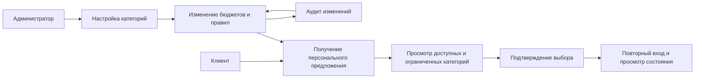
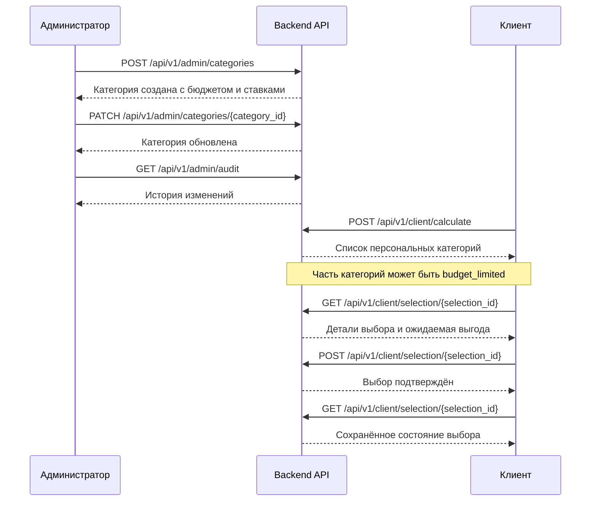

# User Journey: Cashback Service

## Зачем этот сервис

Сервис персонализированного кэшбэка должен удерживать баланс между двумя сторонами:

- клиент получает понятную и ощутимую выгоду;
- банк сохраняет контроль над бюджетами и экономикой сервиса.

В этой версии проекта backend уже показывает базовый сквозной сценарий:

- администратор управляет категориями;
- клиент получает персональное предложение;
- клиент подтверждает выбор;
- сервер объясняет ограничения по бюджету и валидирует критичные поля на своей стороне.

---

## Карта ролей

---

## E2E-маршрут

### 1. Администратор настраивает категории

На этом этапе бизнес определяет, какие категории участвуют в механике кэшбэка и на каких условиях.

Что задаётся:

- название и подзаголовок категории;
- иконка;
- статус;
- бюджет;
- диапазон ставок;
- аудитория;
- fallback-сообщение для клиента.

Связанные маршруты:

- `GET /api/v1/admin/categories`
- `POST /api/v1/admin/categories`
- `GET /api/v1/admin/categories/{category_id}`
- `PATCH /api/v1/admin/categories/{category_id}`

Реализация:

- [server.py](/Users/egor/Проекты/backend/server.py)
- [api/categories.py](/Users/egor/Проекты/backend/api/categories.py)
- [api/validate.py](/Users/egor/Проекты/backend/api/validate.py)

Что уже контролирует сервер:

- нельзя отправить пустые ключевые строки;
- нельзя задать отрицательный бюджет;
- нельзя задать `rate_min > rate_max`;
- нельзя отправить пустой список сегментов.

### 2. Администратор меняет условия и отслеживает историю

После первоначальной настройки бизнес может обновить бюджет категории, диапазон ставок или статус и проверить, что изменения зафиксированы.

Связанные маршруты:

- `GET /api/v1/admin/categories/{category_id}`
- `PATCH /api/v1/admin/categories/{category_id}`
- `GET /api/v1/admin/audit`

Реализация:

- [api/categories.py](/Users/egor/Проекты/backend/api/categories.py)
- [api/audit.py](/Users/egor/Проекты/backend/api/audit.py)

Смысл для демо:

- показать управляемость категории как сущности;
- показать, что действия администратора можно объяснить и отследить.

### 3. Клиент запускает персональный расчёт

Клиент открывает экран персонального предложения. Backend возвращает список категорий не просто как каталог, а как результат расчёта на период.

Связанный маршрут:

- `POST /api/v1/client/calculate`

Реализация:

- [api/calculate.py](/Users/egor/Проекты/backend/api/calculate.py)

Что получает клиент:

- идентификатор выбора `selection_id`;
- категорию;
- диапазон ставки;
- ожидаемую выгоду;
- статус доступности;
- причину ограничения, если категория недоступна полностью или частично.

В текущем демо уже есть два характерных кейса:

- `Restaurants` доступна для выбора;
- `Fuel` помечена как `budget_limited` и сопровождается объяснением.

Это важная продуктовая точка: интерфейс честно объясняет, что часть выгоды ограничена бюджетом, а не просто скрывает категорию.

### 4. Клиент открывает экран выбора

После расчёта клиент переходит в конкретную карточку выбора по `selection_id`.

Связанный маршрут:

- `GET /api/v1/client/selection/{selection_id}`

Реализация:

- [api/selection.py](/Users/egor/Проекты/backend/api/selection.py)

На этом экране клиент должен видеть:

- выбранную категорию;
- диапазон ставки;
- ожидаемую выгоду;
- текущее состояние доступности;
- сообщение об ограничении по бюджету, если оно есть.

### 5. Клиент подтверждает выбор

Когда клиент соглашается с предложением, выбор подтверждается на сервере.

Связанный маршрут:

- `POST /api/v1/client/selection/{selection_id}`

Реализация:

- [api/selection.py](/Users/egor/Проекты/backend/api/selection.py)

Что важно:

- сервер возвращает итоговый статус подтверждения;
- в API-контракте предусмотрен `Idempotency-Key`;
- это позволяет защититься от повторного подтверждения и дублей действий.

### 6. Клиент возвращается повторно

При повторном входе пользователь должен видеть, что его выбор сохранён и система помнит текущее состояние.

В текущем backend это можно показать через:

- повторный расчёт `POST /api/v1/client/calculate`;
- повторное чтение `GET /api/v1/client/selection/{selection_id}`.

Полноценный отдельный `progress` endpoint в коде пока не реализован, но уже предусмотрен целевой моделью API.

Источник целевой модели:

- [cashback_api.md](/Users/egor/Проекты/backend/docs/cashback_api.md)

---

## Визуальный сценарий по шагам

---

## Что демонстрирует проект уже сейчас

- управляемую категорию как отдельную бизнес-сущность;
- персональное предложение как отдельный этап клиентского сценария;
- объяснение недоступности категории через бюджетное ограничение;
- серверную валидацию части инвариантов;
- аудит действий администратора;
- контракт на идемпотентное подтверждение выбора.

---

## Что ещё не доведено до полной промышленной постановки

- отдельные endpoints для `rules`;
- отдельные endpoints для `budgets` и `ledger`;
- батчевый запуск `offers/run`;
- полноценный `progress` endpoint;
- реальное резервирование и списание бюджетов в транзакции;
- формальный движок budget control;
- полноценное хранение сущностей в БД.

Сейчас это демо-скелет, который уже хорошо показывает логику продукта и пользовательский маршрут, но ещё не реализует весь контур бюджетных инвариантов из постановки.

---

## Ключевая мысль для презентации

Этот сервис не просто предлагает категории кэшбэка. Он строит прозрачный цикл:

1. бизнес управляет категорией как продуктом;
2. backend формирует персональное предложение;
3. клиент видит ожидаемую выгоду и ограничения;
4. подтверждение фиксируется на сервере;
5. изменения бюджетов и правил остаются управляемыми и объяснимыми.
